# Chapterlyapp
-This app is a book library and reading tracker to build a habit of consistent reading and to get a clear picture of what books you have read, the books you want to read, and clear daily statistics.

## Introduction
-i made a little introduction to the app where the main features of the app are explained when the user first opens the app after download (IntroductionView.swift).

# MainScreen
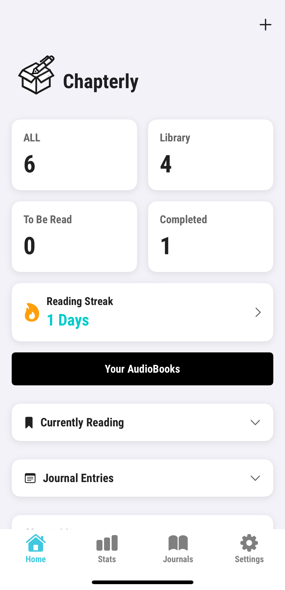

## Navigation bar
-There are 4 parts in the navigation bar, one for the MainScreen.swift indicated by the house icon, one for the StatsScreen.swift indicated by the stat icon, one for the JournalsScreen.swift indicated by the book and one for the SettingsSreen.swift indicated by the cog icon.

## Adding a book
-The user can add a book by clicking the plus button where they can manually add a book in the AddBookSection.swift or scan the book barcode with the ScannerView.swift, for the scanning i used google books api to access the database of books that adds the book into the library. 

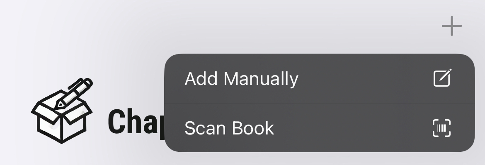

## Book Catagories
-The user can catagorize their books into "To Be Read", "Completed", "Currently Reading" and also view their all of their books with the "All" button these 4 buttons when clicked upon takes the user to the BookSection.swift, LibrarySection.swift, LibrarySection.swift & ToBeRead.swift where the user can from there add a book to the different catagories with the 5 small buttons and the user can also access the books image, title, descripton by clicking on the book card in the booksection where the user can change the status of the book, add it to the wishlist or add a journal entry.    

## Streak Feature
-Underneath these 4 category buttons the user can view their reading streak (StreakViewModel & StreakCard in MainScreen.swift) where they can see the consecutive days they have read in order to build a reading habit, and when the user clicks this card they are taken to a mini quiz (RecommendationScreen.swift) where the user selects their favourite genres and reading moods and then gets a few recommendations that they can add to their ToBeReadSection.swift 

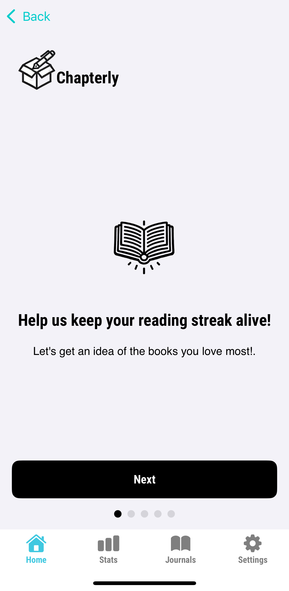
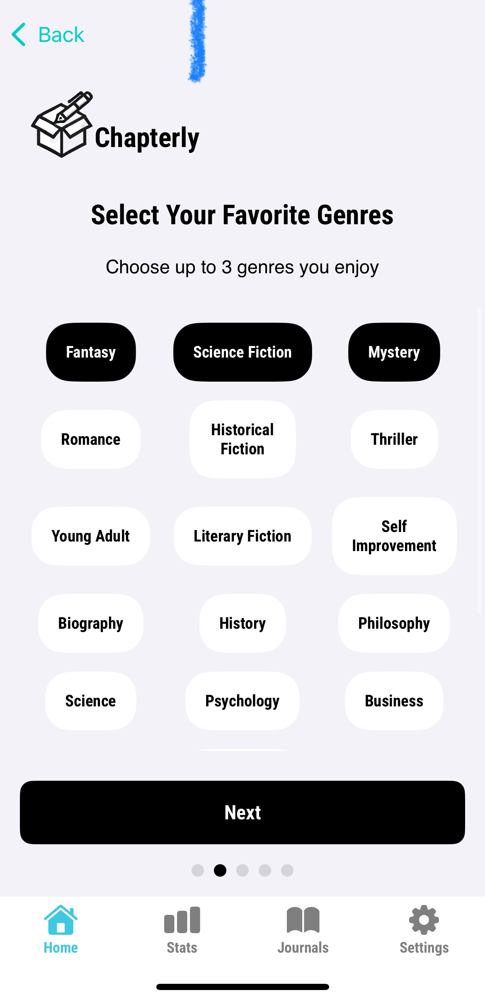
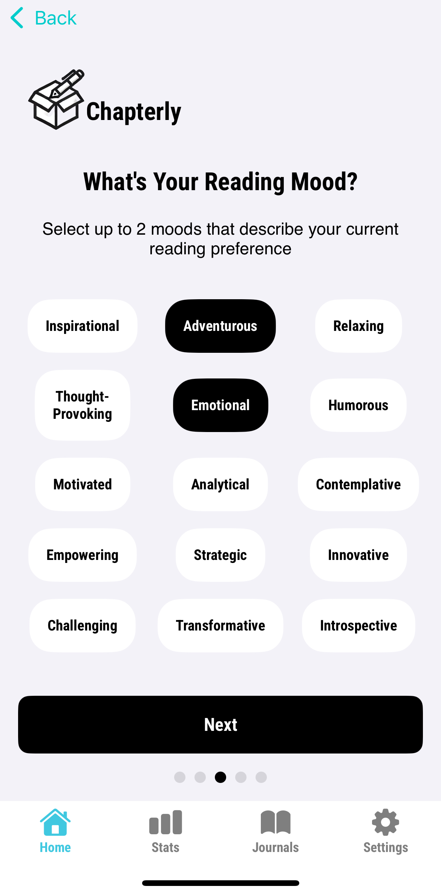
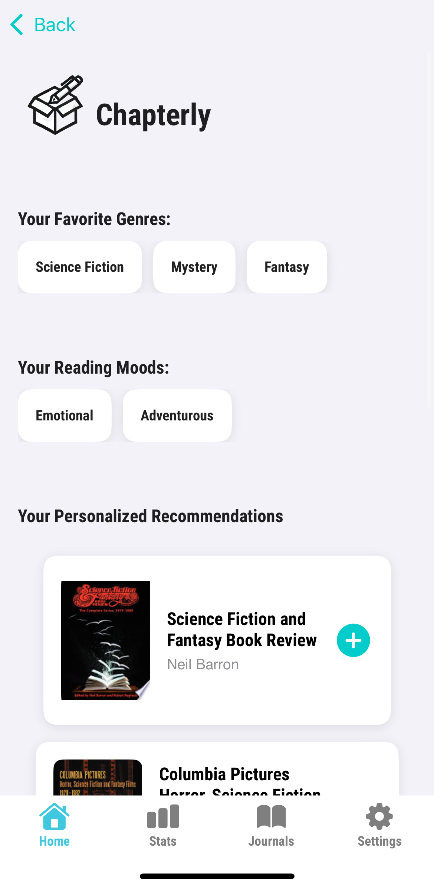

### Streak Widget
-I have made a Streak widget that is a small widget where the user can view their streak from their homescreen (StreakWidget folder) the functionality is fine but the looks is kinda bad but it is what it is i wanted to make it like the duolingo streak widget but its whatever.

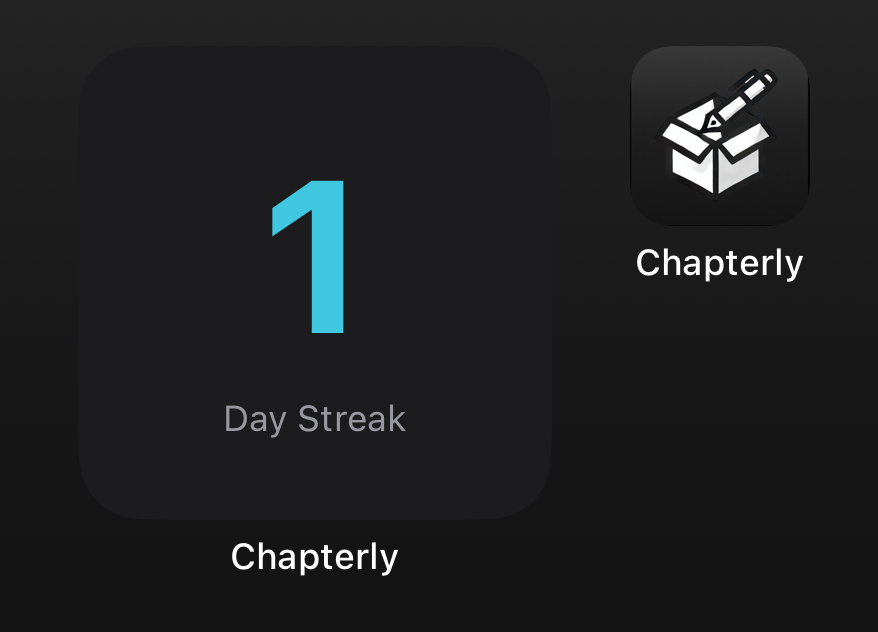

## AudioBooks 
-I added a seperate black button on the MainScreen.swift that when clicked, the user can search for book titles in a search bar and can add books into this distinct audiobook section (AudioBooksSection.swift), (you cant scan audiobooks so i had to do a search bar) this way the paperback books and audiobooks are seperated so the user knows which is which.

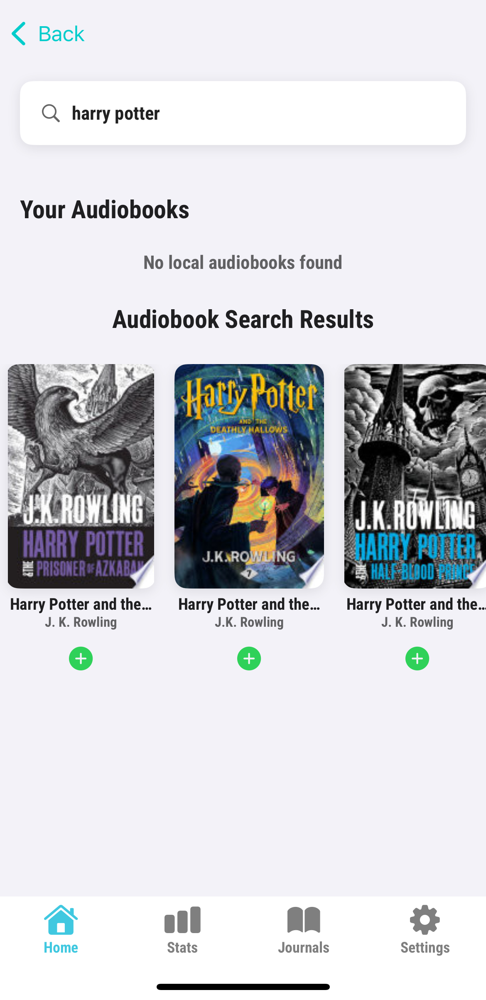

## Expandables
-Now lastly on the MainScreen.swift i added 4 expandables, the first is "Currently Reading" which when clicked on you can view all the books in your "librarySection" then i added "Journal entries" this is an expandable where the user can view the journal entries (basically notes) which can be created in the journals section i will talk about later. Then i added the Wishlist expandable where the user can view books they want to buy, and then i added "reading hours" expandable where the user can manually input hours and minutes read and view the amount of time read Daily, weekly and monthly and there is also a log of what days the user has read a book and for how long. (ReadingHoursViewModel & ReadingHoursTrackerView.swift) 

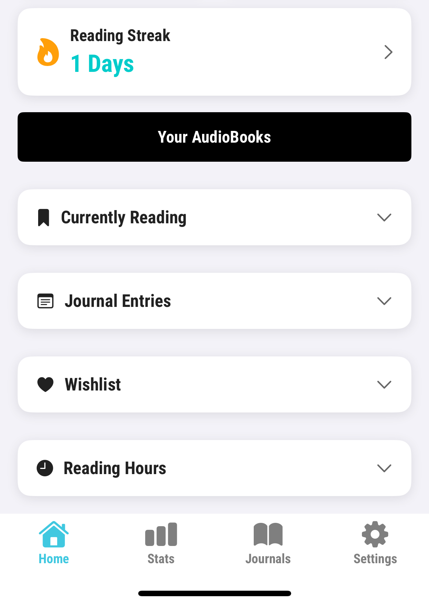
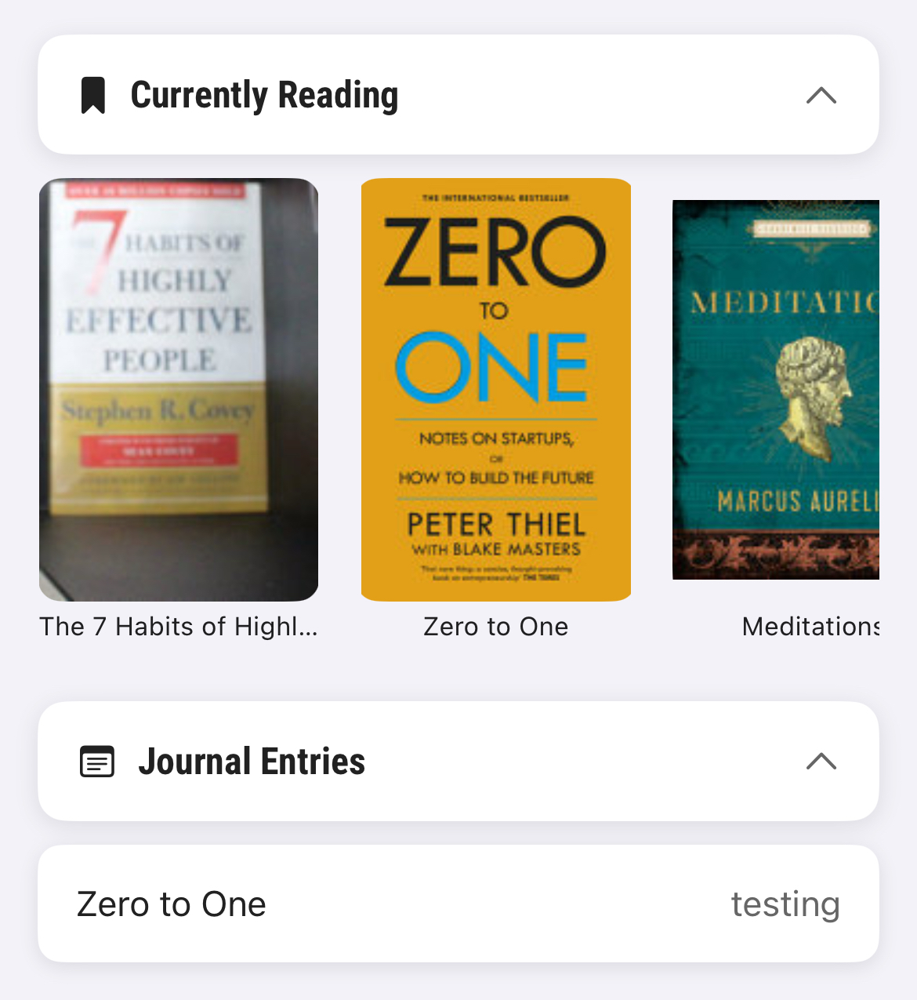

# StatsScreen

-In the StatsScreen.swift the user can see 3 tabs at the top of the page that says "Day", "Week", "Month" then there is a card that displays the users total reading time for the day, week or month with the average amount read daily and the longest reading session the user has had, thne underneath that i added a "currently reading" card with a start tumer and stop timer button underneath and this allows a user to track the time spent reading a certain book which they can track by clicking on this card and clicking track on any book that is in the users library, and the user can also check the amount of hours and minutes read of a specific book and the days and time the user has read that book and for how long by clicking "Book log". Then there is a graph that displays the users activity and another "reading sessions" log displaying the users reading log. 

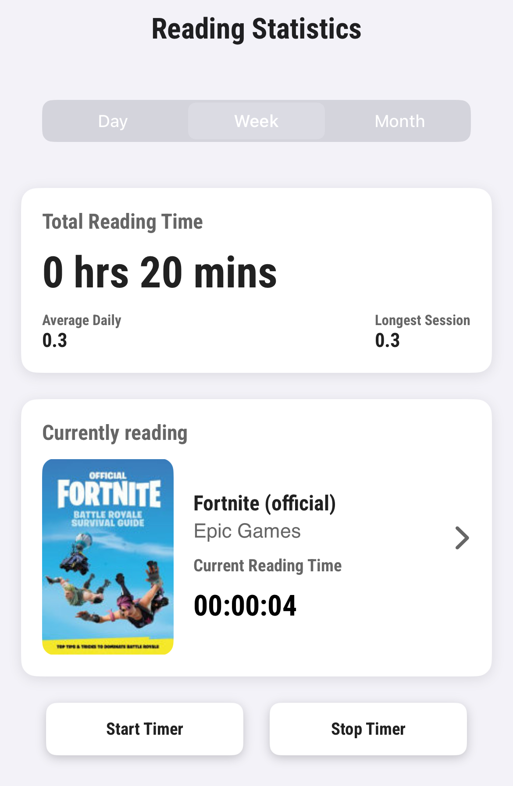

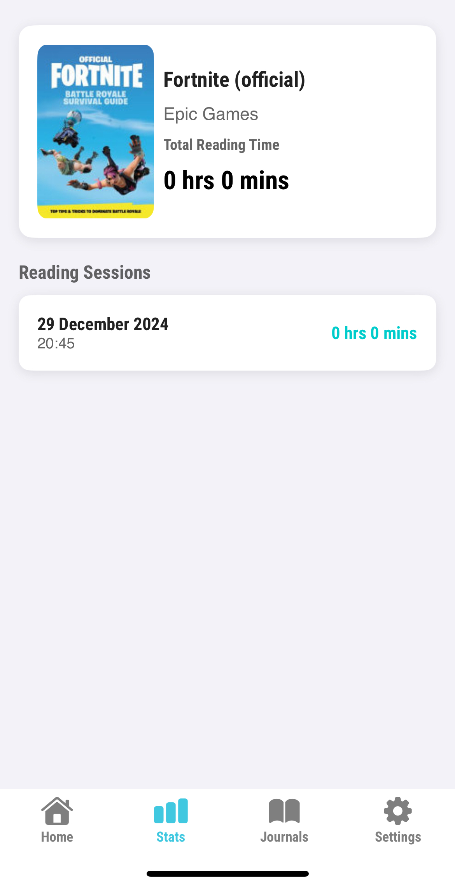

## BookLog widget
-i made an additional widget that serves as a view of the amount of time read of a specific book for the user to view on their homescreen (ReadingTimerWidget folder) it initially served the purpose to start the book timer on the homescreen/lockscreen but i could not get that feature to work unfortunately but this is a suitable conpromise. 

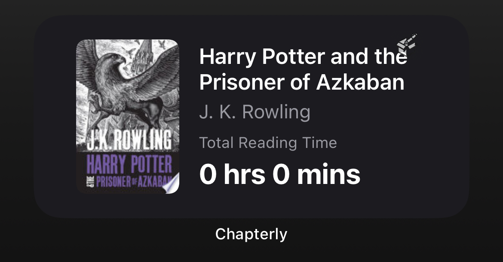

# journals 

-in this screen the user is shown all of their books in the library in a horizontal slide abd then a header under that saying "View journals" where they can can view all of the individual journals that the user has written, and if the user wants multiple journals for one book the user can click the book on the screen and click "add First entry" and the plus icon after the first entry 

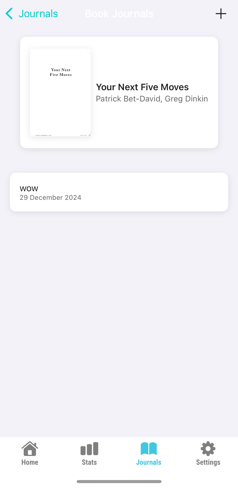
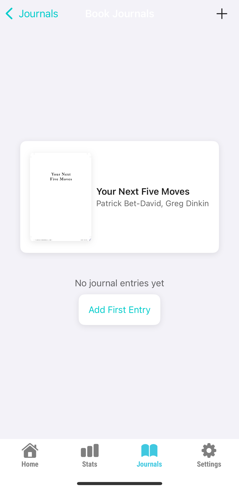

# Settings

-In settingsScreen.swift there are just 4 buttons, one is to clear all of the books, one is to reset the statistics and the other is to reset all journals and i have an extra button for the user to leave a review since i plan to put this out on the app store.

